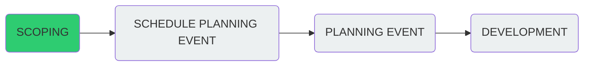

# Project Scheduling Tasks

### Do we know enough to:

- Start planning?
- Start developing?

---

### Tasks

| **Task**                             | **Examples of option range**                                                                                       |
| ------------------------------------ | ------------------------------------------------------------------------------------------------------------------ |
| Clear vision of end product(s)       | `clear vision`                                                                              |
| Number of deliverable(s)             | `app/(website if required?)`                                                                       |
| Requirements                         | `clearly defined/none`                                                                                             |
| Understanding of users               | `external/specialists/public` (users may not always be people, but other systems)                                                                    |
| Funding                              | `full from OneGeology Budget`                                                                       |
| Deadlines                            | `Flexible but ideally before Q3 2020`                                                                                    |
| Frontend                             | `frameworks - https://github.com/TerriaJS/terriajs`                                                                                               |
| Middleware                           | `API/authentication/user accounts - not required, all open data`                                                                                 |
| Backend                              | `Existing web services`                                                                                |
| Ownership of development             | `in-house`                                                                             |
| Data                                 | `complete`  
|
| SNS                                  | `DNZ/linux/security/email/firewalls/new hardware`?                                                                  |
| Testing                              | `stakeholder engagement/fit with iterative agile development/prevision required/users availabilty/develop&deliver` |
| Maintenance                          | `regular maintenance by OneGeology`
|
| Team has all skills needed           | `yes`                                                                                                           |
| Team needs skills from other team(s) | `no`                                                                                                           |
| New skills required                  | `self-guided`                                                                                     |
| Specialist domain knowledge needed   | `no`                                                                                                           |
| Corporate database required          | `no
