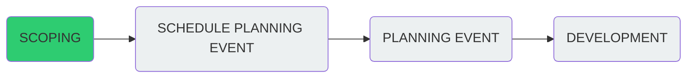

# Project Scheduling Tasks

### Do we know enough to:

- Start planning?
- Start developing?

---

### Tasks

| **Task**                             | **Examples of option range**                                                                                       |
| ------------------------------------ | ------------------------------------------------------------------------------------------------------------------ |
| Clear vision of end product(s)       | `clear vision/still deciding/no idea`                                                                              |
| Number of deliverable(s)             | `website/app/documentation/poster/copy text`                                                                       |
| Requirements                         | `clearly defined/none`                                                                                             |
| Understanding of users               | `internal/external/specialists/public/unknown` (users may not always be people, but other systems)                                                                    |
| Funding                              | `full/limited/none/bids incoming/commercial`                                                                       |
| Deadlines                            | `fixed/flexible/BGS-style/none`                                                                                    |
| Frontend                             | `vanilla/frameworks`                                                                                               |
| Middleware                           | `API/authentication/user accounts`                                                                                 |
| Backend                              | `database(s)/corporate/open-source`                                                                                |
| Ownership of development             | `in-house/co-developed/sub-contracted`                                                                             |
| Data                                 | `complete/needs processing/needs collecting/realtime/updates`                                                      |
| SNS                                  | `DNZ/linux/security/email/firewalls/new hardware`                                                                  |
| Testing                              | `stakeholder engagement/fit with iterative agile development/prevision required/users availabilty/develop&deliver` |
| Maintenance                          | `deliver and forget/regular maintenance by BGS/externally hosted`                                                  |
| Team has all skills needed           | `yes/no`                                                                                                           |
| Team needs skills from other team(s) | `yes/no`                                                                                                           |
| New skills required                  | `training/courses/self-guided`                                                                                     |
| Specialist domain knowledge needed   | `yes/no`                                                                                                           |
| Corporate database required          | `yes/no
